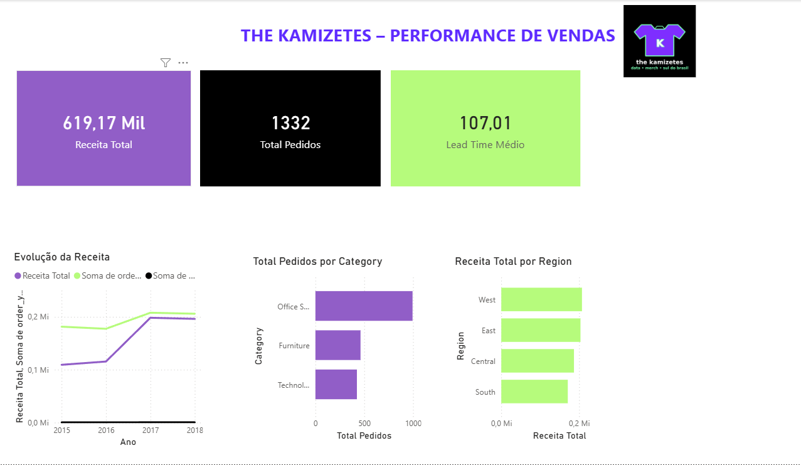

# The Kamizetes – Análise de Vendas

Este projeto tem como objetivo analisar as vendas de uma empresa fictícia chamada **The Kamizetes**, especializada na venda de camisetas. O objetivo é explorar dados transacionais de vendas, entender o desempenho do negócio e gerar insights sobre as métricas de vendas, produtos e clientes.

Como estão as vendas e a receita ao longo do tempo?

Quais produtos e linhas performam melhor?

Quais clientes/segmentos são mais rentáveis?

Como a logística impacta prazo e performance?

O que muda quando olhamos determinadas regiões como mercado prioritário?

O projeto utiliza Python para análise de dados e Power BI para criar um dashboard interativo.

# Entendimento do dataset (o que tem no train.csv)

O arquivo é um “pedido por item” (cada linha = um item vendido dentro de um pedido).

Campos principais:

Datas: Order Date, Ship Date

Logística: Ship Mode

Cliente: Customer ID, Customer Name, Segment

Geografia: City, State, Postal Code, Region, Country

Produto: Product ID, Category, Sub-Category, Product Name

Receita: Sales

# Métrica-chave adicional (você vai criar):

Lead Time (dias) = Ship Date − Order Date

Order Month, Order Year, Week, Day of Week

AOV (ticket médio) = Sales / nº de pedidos (em nível de pedido)

# Ingestão e limpeza (ETL passo a passo)

 **Importar e padronizar**

Ler CSV

Converter Order Date e Ship Date para datetime

Padronizar textos (trim/uppercase/lowercase)

Tratar Postal Code como texto (evita perder zeros)

 **Regras de qualidade**

Remover duplicatas por Row ID (se existirem)

Checar nulos em: datas, Sales, Product ID, Order ID

Validar Sales:

Sales <= 0 → revisar/filtrar conforme a narrativa (startup geralmente não quer vendas zeradas)

# Criar colunas derivadas

ship_lead_days = (Ship Date − Order Date).days

order_year, order_month, order_yyyymm

weekday (0–6) e weekday_name

is_weekend

# Camada “The Kamizetes” (transformação de negócio)

Aqui é onde você “vira” o dataset para o contexto de camisetas.

Reclassificar produtos para “linhas de camiseta”

Você vai criar uma coluna collection a partir de Sub-Category / Product Name, por exemplo:

“Street”

“Minimal”

“Geek”

“Workwear”

“Sport”

“Winter Drop” (para reforçar Sul)

Para demonstrar a análise regional, utilizei a coluna Region como proxy de mercado e repliquei o raciocínio para o cenário de determinadas regiões. Em um ambiente real, eu usaria UF real do CRM/ERP.”

# Setup do projeto

the-kamizetes-analytics/
  data/
    raw/train.csv
    processed/fact_sales.parquet
  notebooks/
    01_ingest_clean.ipynb
    02_eda.ipynb
    03_features.ipynb
  dashboard/
    powerbi/  (ou streamlit/)

## Tecnologias Utilizadas

- **Python**: A principal linguagem para análise de dados.
  - **Pandas**: Manipulação e análise de dados.
  - **Matplotlib**: Para visualização dos dados.
  - **Parquet**: Formato de dados utilizado para armazenar e manipular os dados de maneira eficiente.

- **Power BI**: Ferramenta para visualização de dados e construção de dashboard interativo.

## Objetivos do Projeto

O principal objetivo deste projeto é realizar uma análise de vendas e comportamento de clientes de uma empresa de camisetas, com foco em:

- Análise da **receita total** e **distribuição por ano/mês**.
- Entendimento do desempenho de vendas **por categoria de produto**.
- Identificação de **clientes de alto valor**.
- Análise de **tempo de entrega** e sua correlação com a satisfação do cliente.
- Criação de um **dashboard interativo** para visualização e análise dos dados.

## Etapas do Projeto

O projeto foi dividido em três etapas principais:

1. **Ingestão e Limpeza de Dados (ETL)**:
   - Leitura do dataset original, que contém informações de pedidos de clientes, e transformação das colunas para um formato mais adequado para análise.
   - Remoção de dados nulos ou inconsistentes.

2. **Análise Exploratória de Dados (EDA)**:
   - Realização de uma análise detalhada para entender o comportamento das vendas.
   - Identificação de padrões e tendências de receitas, produtos e clientes.
   - Visualização dos dados para facilitar o entendimento e a apresentação dos resultados.

3. **Engenharia de Features**:
   - Criação de novas variáveis que ajudam a identificar clientes de alto valor e classificar entregas rápidas.
   - Enriquecimento do dataset com novas colunas de interesse.

4. **Criação do Dashboard (Power BI)**:
   - Construção de um painel interativo para visualização dos KPIs de vendas, receita, produtos e clientes.
   - Adição de filtros dinâmicos para que o usuário possa explorar diferentes cenários.

## Como Executar o Projeto

### Requisitos

- Python 3.x
- Power BI Desktop (para visualização do dashboard)

### Passos

1. **Baixar o código**: Clone ou baixe o repositório.

git clone https://github.com/Anajaraa/the-kamizetes-analytics.git

2. # Instalar as dependências:

Instale as bibliotecas necessárias para rodar o código Python:
pip install pandas matplotlib

3. # Rodar os scripts de análise:

Execute o script de ingestão e limpeza de dados:
python notebooks/01_ingest_clean.py

Em seguida, execute a análise exploratória:
python notebooks/02_eda.py

E, por fim, rode a engenharia de features:
python notebook/03_features.py

# Abrir o dashboard no Power BI:

Importe os arquivos .parquet gerados para o Power BI (localizados na pasta data/processed).

# RESULTADO:

**Análise Exploratória:** Você verá uma visão geral da receita por mês, a receita por categoria de produto, e as métricas de performance dos produtos e clientes.

**Engenharia de Features:** Novas variáveis, como o "tempo de entrega" e "clientes de alto valor", serão geradas e podem ser usadas para uma análise mais profunda.

**Dashboard:&* Um painel interativo será criado, permitindo a visualização dos KPIs, métricas e gráficos para análise de vendas e clientes. O dashboard também permitirá filtrar os dados por ano, categoria, e região.

# Conclusão:

 Esse projeto permitiu uma análise detalhada de vendas e comportamento dos clientes da "The Kamizetes", com foco na criação de métricas e insights relevantes. Além disso, foi criado um dashboard interativo, que pode ser utilizado para decisões de negócio.